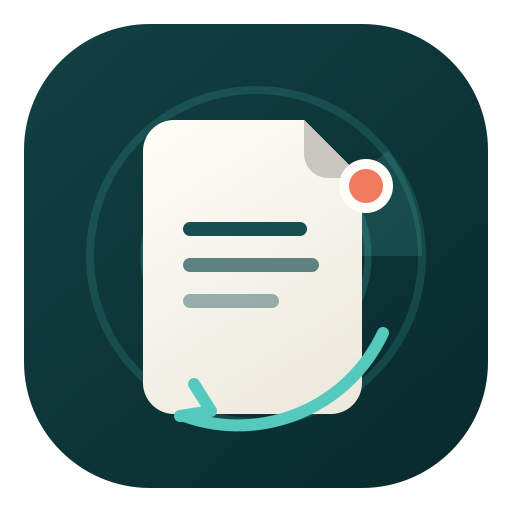
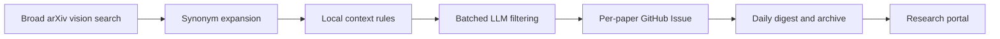

<div align="center">
  

  <h1>PaperClaw</h1>

  <p><strong>A personal paper radar for multimodal vision and UAV research</strong></p>
  <p>Broad visual search · Local rule recall · LLM filtering · GitHub Issue knowledge cards</p>

  <p>
    <a href="https://zitalk.github.io/PaperClaw/"></a>
    <a href="https://github.com/zitalk/PaperClaw/issues"></a>
    
  </p>

  <p><a href="./README.md">中文</a> · <a href="https://zitalk.github.io/PaperClaw/">Portal</a> · <a href="./daily_reports/">Daily reports</a> · <a href="https://github.com/zitalk/PaperClaw/issues">Paper library</a></p>
</div>

---

> PaperClaw turns the daily stream of new papers into searchable research leads instead of a local pile of PDFs.

## What it does

PaperClaw searches broad arXiv vision categories, supplements them with cross-category synonyms, applies high-recall visual-context rules, and asks an LLM to make the final research-relevance decision in batches.

Each selected paper becomes a structured GitHub Issue. Daily results are published as a digest, a Markdown archive, and a searchable GitHub Pages portal.

| Stage | Behavior |
|---|---|
| Discovery | Searches `cs.CV`, `eess.IV`, `cs.RO`, `cs.MM`, and `eess.SP` plus keyword supplements |
| Recall | Expands synonyms and applies local visual-context rules |
| Precision | Uses batched LLM filtering against the personal research profile |
| Reading | Creates one structured GitHub Issue per paper |
| Delivery | Builds a daily digest, Markdown archive, and web portal |
| Storage | Treats PDFs and arXiv sources as transient analysis inputs and removes them by default |

## Research radar

- Multimodal perception: RGB-T, RGB-D, RGB-NIR, RGB-Event, hyperspectral and audio-visual learning
- Salient and small targets: multimodal saliency, infrared small targets, text-guided detection and segmentation
- Tracking and multi-view vision: MOT, ReID, cross-camera association and 3D perception
- UAV vision: detection, tracking, segmentation, navigation, reconstruction and multi-UAV cooperation
- Training-free open-set segmentation: open-vocabulary, zero-shot and annotation-free dense prediction with frozen foundation models

## Pipeline



The research profile lives in [`filter_keywords.json`](./skills/rs-paper-pipeline/scripts/config/filter_keywords.json), while the final relevance rubric lives in [`filter_cross_prompt.md`](./skills/rs-paper-pipeline/scripts/prompts/filter_cross_prompt.md).

## Run locally

```powershell
Set-Location skills/rs-paper-pipeline
.\bootstrap.ps1
Copy-Item .env.example .env
```

Set `GITHUB_TOKEN`, `LLM_API_KEY`, and `RS_GITHUB_REPO=zitalk/PaperClaw` in `.env`, then run:

```powershell
.\.venv\Scripts\python.exe scripts\cli.py doctor
.\.venv\Scripts\python.exe scripts\cli.py filter --dry-run --date YYYYMMDD
.\.venv\Scripts\python.exe scripts\cli.py run --date YYYYMMDD --no-notify
```

Do not commit `.env`. Downloads are cleaned after processing unless `RS_KEEP_DOWNLOADS=true` is set explicitly.

## Automation

GitHub Actions runs the paper search remotely from Monday to Friday, so it does not depend on a personal computer staying online. At **03:00 Asia/Shanghai** it checks the latest weekday's new papers, with retries at **09:30, 12:30, and 15:30** for delayed arXiv publication. Weekends are neither scanned nor backfilled, completed dates are skipped automatically, and the Pages workflow republishes the site after a daily report update.

## Acknowledgements

PaperClaw originated from the Issue-driven tracking idea in [thinson/RS-PaperClaw](https://github.com/thinson/RS-PaperClaw) and has been independently rebuilt around a personal multimodal-vision, saliency, and UAV research profile.
